# 설정파일 옵션

BI-REQUIRED! 를 사용하기 위해서는 JSON 으로 구성된 설정파일 ( 하단 JSON 형식 ) 을 설정해야 합니다.<br>

이 레이아웃 설정에 따라서 BI-REQUIRED 를 좀 더 사용자 친화적으로 만들어서 상황과 목적에 맞게 적절하게 사용할 수 있습니다.<br>

설정 파일의 옵션을 확인해보고, 적용하여 다양한 기능을 알아보겠습니다. 
<br>
<br>

```json
{
	"Layout": {
		"info": "정보영역-텍스트",
		"title": "타이틀영역-텍스트",
		"grand_total_percent": true,
		"menu_nav": "expended",
		"charts": {
			"charts_config": "pie-sankey.json",
			"show": true,
			"template_list": "0_layout_list.json"
		},
		"table_display": true,
		"expanded_collapsed_mode": true,
		"transpose": false,
		"total_first": true,
		"error_value": "오류",
		"excelfile": "excel_pivot_table_data",
		"rows": [
			"CustType",
			"AgeGroup"
		],
		"columns": [
			"Gender"
		],
		"values": [
			{
				"field": "ResponseCount",
				"op": "sum",
				"precision": ""
			},
			{
				"field": "ContactCount",
				"op": "sum",
				"precision": ""
			},
			{
				"field": "반응률",
				"op": "sum",
				"precision": ""
			}
		],
		"calculated": [
			{
				"fieldheader": "반응률(%)",
				"calculatedname": "반응률",
				"formula": "ResponseCount / ContactCount * 100",
				"precision": ".00",
				"surfix": "%",
				"error_value": "calcu error code"
			},
			{
				"fieldheader": "오퍼율(%)",
				"calculatedname": "오퍼률",
				"formula": "OfferCount / ContactCount * 100",
				"precision": ".00",
				"surfix": "%",
				"error_value": "calcu error code"
			}
		],
		"thousand_delimeter": "",
		"blank_text": "(blank)",
		"selectcolor": "#999999",
		"columntotal": {
			"show": true,
			"label": "합계"
		},
		"subtotal": {
			"show": false,
			"label": "소계"
		},
		"grandtotal": {
			"show": true,
			"label": "총계"
		},
		"Slicer_display": "expanded",
		"percentage": [
			{
				"field": "SalesCount",
				"option": "BYGRANDTOTAL",
				"precision": ".00",
				"surfix": "(%)"
			}
		],
		"formatting": [
			{
				"field": "SalesCount",
				"type": "bar",
				"option": "#ff555a"
			},
			{
				"field": "SalesAmt",
				"type": "map",
				"option": "#ffff00"
			},
			{
				"field": "ContactCount",
				"type": "icons",
				"option": "5-arrows"
			}
		],
		"themes": [
			{
				"name": "ghostwhite",
				"class": "ghostwhite-theme"
			},
			{
				"name": "lightblue",
				"class": "lightblue-theme"
			},
			{
				"name": "lightgrey",
				"class": "lightgrey-theme"
			}
		],
		"set_theme": "lightblue",
		"slicer": {
			"position": "top",
			"fields": [
				{
					"field": "Gender",
					"size": 5
				}
			]
		},
		"column_sorting": [
			{
				"fieldname": "AGE",
				"sorttype": "DESC"
			}
		],
	    "backGroundhighlight": [
			{
				"field": "반응률",
				"color": "#FFD8D6",
				"condition": [
					"between 23 and 25"
				]
			},
			{
				"field": "ContactCount",
				"color": "#FFD75A",
				"condition": [
					">3000"
				]
			}
		],
		"foreGroundhighlight": [
			{
				"field": "ContactCount",
				"color": "#FF0001",
				"condition": [
					">5000"
				]
			}
		]
	}
}
```
<br>

---

<br>

## 1. Info

우측 옵션 핸들러에서 맨 하단 정보( i ) 탭에서 보일 내용을 작성하는 곳 입니다.<br>
사용자에게 정보를 HTML태그를 이용하여 전달할 수 있습니다.<br>또한 false 값을 만들어 인포탭을 잠금 할 수도 있습니다.<br>

``` json
{
    "Layout": {
		"info": "인포영역에 출력될 내용입니다!",
```

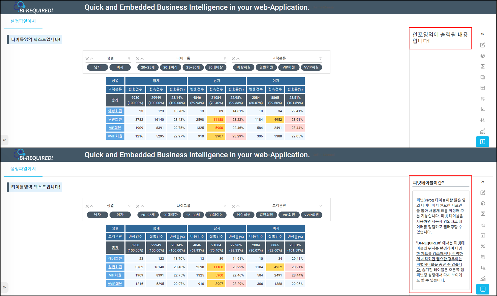

<p align="center"><font size="2m">HTML태그를 사용하여 작성한 정보탭(하단)</font></p>

<br>
<br>

## 2. Title

대시보드 타이틀로 보일 내용을 작성하는 곳입니다.<br>HTML태그를 지원합니다. 인포 옵션과 마찬가지로 false 값을 만들어 대시보드 타이틀을 잠금 할 수도 있습니다.<br>

```json
{
	"Layout": {
		"title":"<h5>타이틀영역에 출력될 내용입니다!<h5>",
```

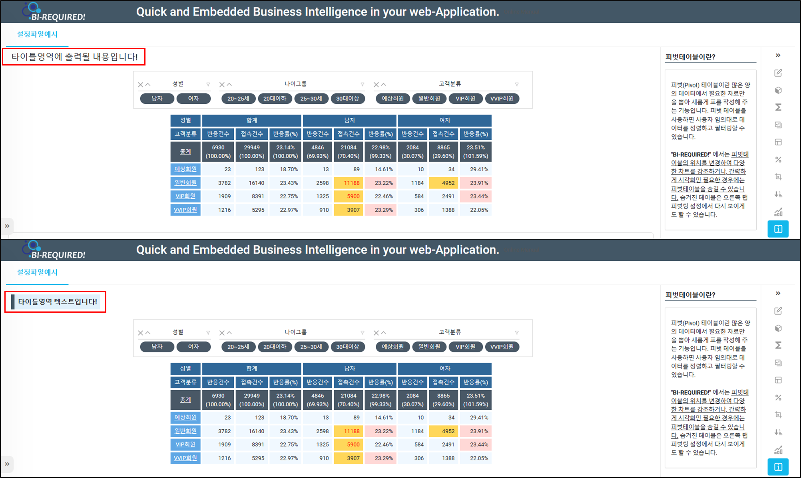

<p align="center"><font size="2m">HTML태그를 사용하여 작성한 대시보드 타이틀(하단)</font></p>

<br>
<br>

## 3. Grand_total_percent

피벗테이블의 전체합(총계)에서 비율(%)을 계산하여 출력합니다.<br>

```json
{
	"Layout": {
		"grand_total_percent": true,
```

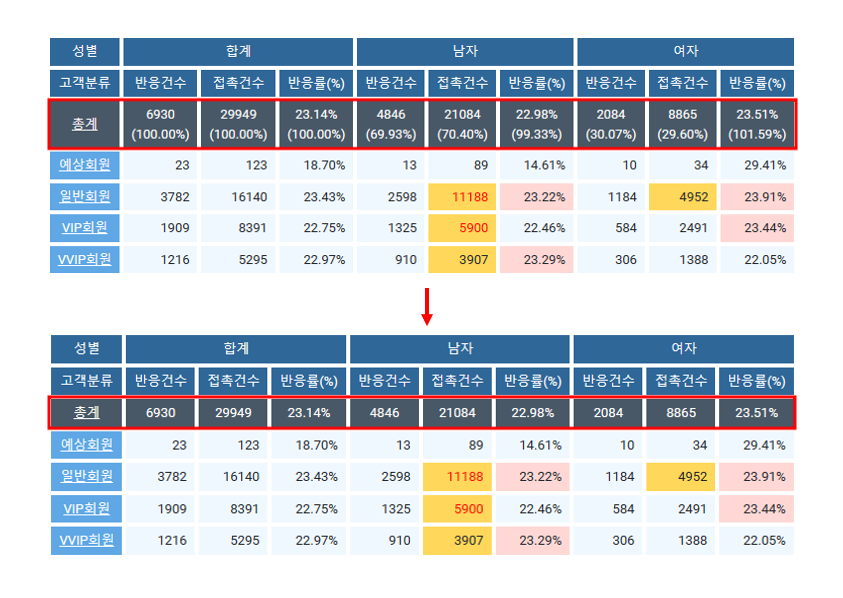

<p align="center"><font size="2m">총계비율(%)출력 (상단피벗테이블 - true 설정), 미출력 (하단피벗테이블 - false 설정)</font></p>

<br>
<br>

## 4. Menu_nav

대시보드를 처음 조회했을때 오른쪽에 보여지는 기능탭 ( 옵션핸들러 )을 확장하여 보여주는 옵션입니다. <br>expanded , collapsed , hidden 3가지의 옵션값을 적용할 수 있습니다. <br>

| 옵션                     | 내용                               | 옵션 설정값 및 예시 |
| ------------------------ | ---------------------------------- | ------------------- |
| "menu_nav" : "expanded"  | 기능탭 ( 옵션핸들러 ) 펼쳐보이기   | "expanded"          |
| "menu_nav" : "collapsed" | 기능탭 ( 옵션핸들러 ) 접기         | "collapsed"         |
| "menu_nav" : "hidden"    | 기능탭 ( 옵션핸들러 ) 비활성화하기 | "hidden"            |

```json
{
    "Layout": {
      "menu_nav": "expanded",
```

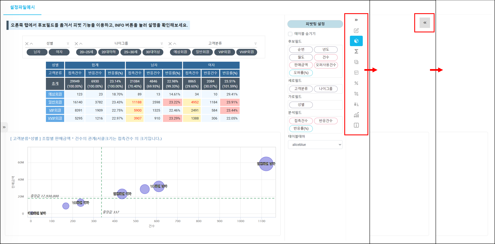

<p align="center"><font size="2m">왼쪽부터 옵션핸들러가 expanded -> collapsed -> hidden 으로 적용된 모습</font></p>

<br>
<br>

## 5. Charts

BI-REQUIRED! 의 대시보드 조회 시 하단 차트 부분에 해당하는 부분입니다.<br>차트 옵션은 매뉴얼 차트 설정하기 페이지에서 더 자세히 알아볼 수 있습니다. <br>

> 차트 적용하기 이동링크

| 옵션 | 내용 | 옵션 설정 값 및 예시 |
| --- | --- | ---|
| "charts_config": "num_bubble.json" | 대시보드가 로딩될때 보여지는 기본 차트에 대한 설정 | "차트명.json"|
| "show": true | 대시보드에서 차트 기능 사용 여부를 설정합니다. | true 또는 false |
| "template_list": "0_layout_list.json"  | 대시보드에서 사용 가능한 차트 템플릿 목록 | "작성한 템플릿 리스트.json" |

```json
{
	"Layout": {
		"charts": {
			"charts_config": "num_bubble.json",
			"show": true,
			"template_list": "0_layout_list.json"
		},
```

<br><br>

## 6. Table_display

대시보드에서 피벗 테이블의 사용 유무를 설정할 수 있는 옵션입니다.<br>

```json
{
	"Layout": {
		"table_display": true,
```

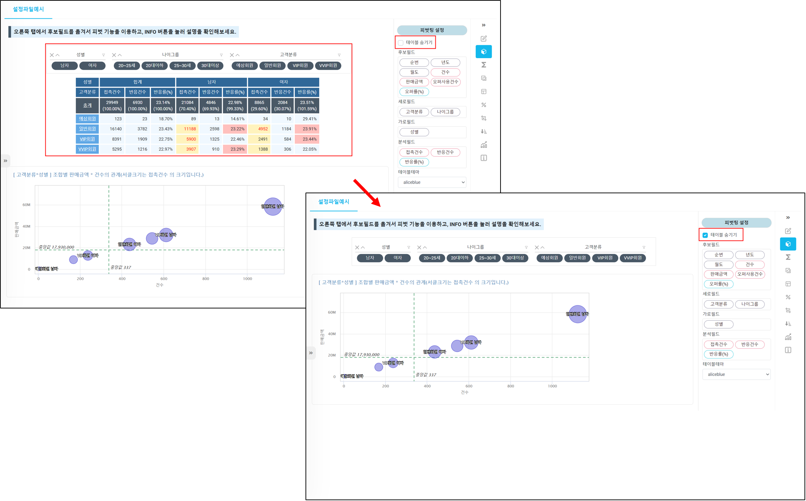

<p align="center"><font size="2m">옵션핸들러의 체크박스를 통해서도 피벗테이블을 활성/비활성화 할 수 있다.</font></p>

<br>
<br>

## 7. Expanded_collapsed_mode

피벗테이블에서 항목 - 확장 기능을 사용 할 것인지 나타냅니다.<br>

```json
{
	"Layout": {
		"expanded_collapsed_mode": true,
```

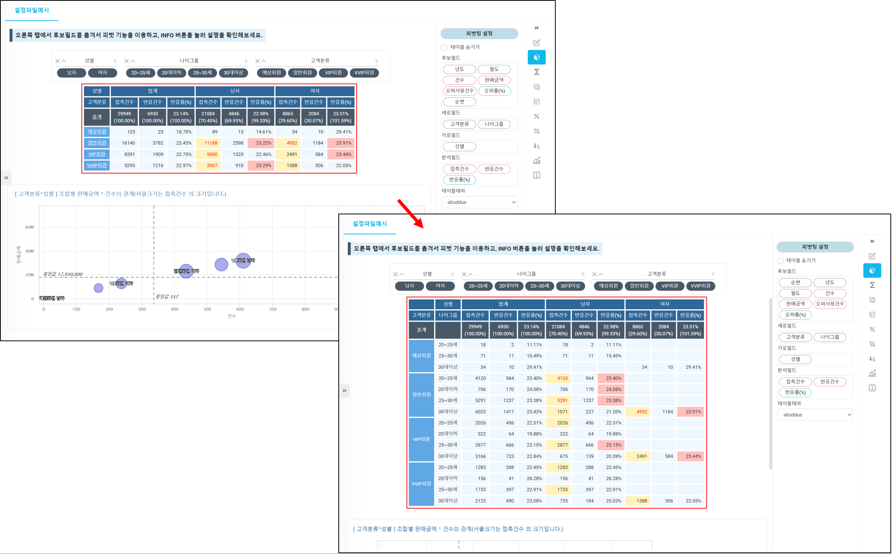

<p align="center"><font size="2m">피벗테이블의 데이터를 더 세부적으로 확인할 수 있는 확장기능이 있습니다.</font></p>

<br>
<br>

## 8. Transpose

바꿔놓다라는 뜻으로 세로셀을 가로셀으로 가로셀을 세로셀로 바꾸는 기능과 비슷합니다. <br>
BI-REQUIRED! 에서는 **피벗테이블 분석필드를 측정기준으로 사용할때**설정하는 옵션입니다.<br>

```json
{
	"Layout": {
		"transpose": true,
```

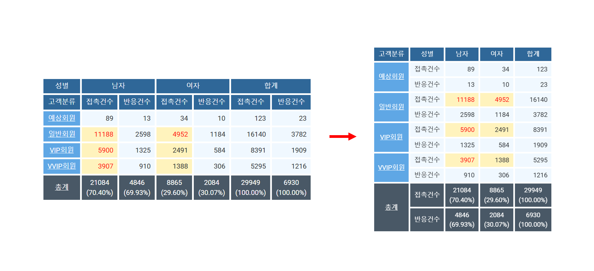

<p align="center"><font size="2m">설정 후 형태가 변경된 피벗테이블</font></p>

<br>
<br>

## 9. Total_first

합계옵션에서 합계를 먼저 보일 것인지를 설정하는 옵션입니다.<br>
행열이 긴 피벗테이블의 경우 합계열 또는 행의 위치를 바꿔서 합계값을 먼저 확인할 수 도 있습니다.<br>

```json
{
	"Layout": {
		"total_first": true,
```

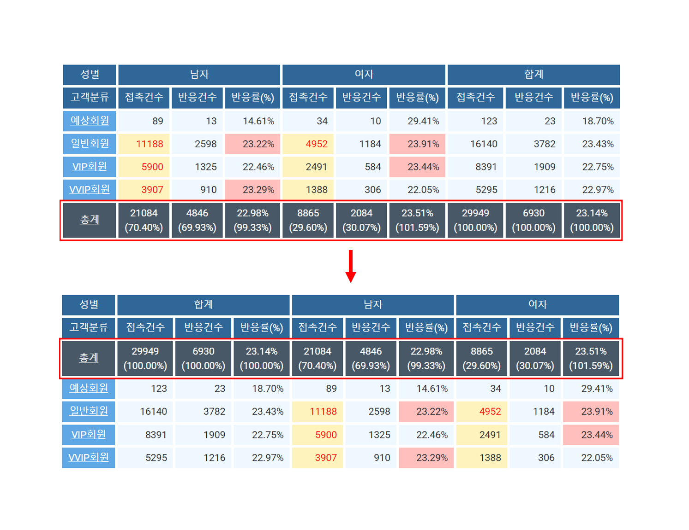

<p align="center"><font size="2m">변경된 합계값 위치</font></p>

<br>
<br>

## 10. Error_value

피벗테이블 계산 오류시 표시되는 텍스트를 설정하는 옵션입니다. <br>

```json
{
	"Layout": {
		"error_value": "오류",
```

<br>
<br>
<br>

## 11. Excelfile

피벗테이블 데이터를 파일로 다운로드 할 경우에 적용되는 파일명에 대한 옵션입니다. <br>
```json
{
	"Layout": {
		"excelfile": "excel_pivot_table_data",
```

<br>
<br>
<br>

## 12. Row & Columns

피벗테이블의 세로필드 와 가로필드에 사용될 필드명을 설정하는 옵션입니다.<br>
기능탭 ( 옵션핸들러 )에서 후보필드를 자유롭게 움직여 피벗팅을 할 수도 있지만, 대시보드 조회시 우선적으로 나올 후보필드를 설정할 수도 있습니다. 최대 3개의 필드명을 사용 할 수 있습니다.<br>

**필드명 ( "FieldName" )은 데이터셋에서 명명할 수 있습니다.** <br>실제로 ***대시보드 화면에 보여지는 필드명은 ( "FieldDesc" ) 필드설명*** 입니다.<br>

> 데이터셋에 대한 자세한 설명 보기 링크

```json
{
	"Layout": {
		"rows": [
			"CustType",
			"AgeGroup"
		],
        "columns": [
			"Gender"
		],
```

<p align="center"><font size="2m">"CustType" 고객분류 와 "AgeGroup" 나이그룹으로 세로필드를 설정하고, "Gender" 성별로 가로필드를 설정하였다.</font></p>

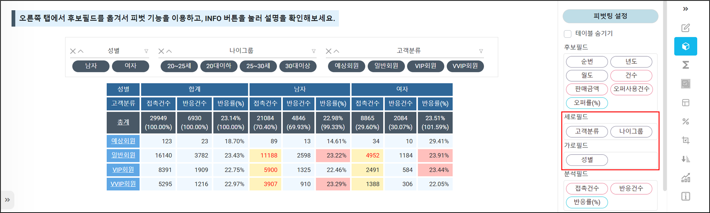

<br><br>

## 13. Values

피벗테이블의 분석필드( 수치형필드 )를 설정하는 옵션입니다.<br>대시보드 조회시 우선적으로 나올 분석필드를 설정합니다. 개수는 제한이 없습니다.<br>

| 옵션                    | 내용                             | 옵션 설정 값 및 예시                    |
| ----------------------- | -------------------------------- | --------------------------------------- |
| "field": "ContactCount" | 필드명을 설정합니다.             | "필드명" ( 데이터셋에서의 "FieldName" ) |
| "op": "sum"             | 계산 유형을 설정 합니다.         | "sum" / "avg"                           |
| "precision": ""         | 계산시 소수점 자리를 설정합니다. | ".0" / ".00"                            |

```json
{
	"Layout": {
		"values": [
             {
				"field": "ContactCount",
				"op": "sum",
				"precision": ""
			},
			{
				"field": "ResponseCount",
				"op": "sum",
				"precision": ""
			},
			{
				"field": "ResponseRate",
				"op": "",
				"precision": ""
			}
		],
```

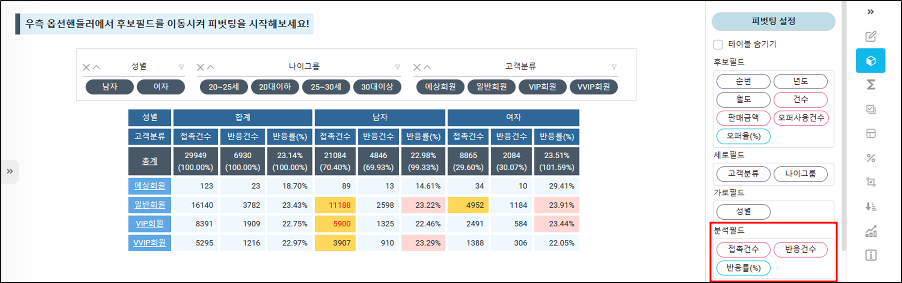

<p align="center"><font size="2m">"ContactCount" 접촉건수, "ResponseCount" 반응건수, 계산값 필드의 "ResponseRate" 반응률(%) 로 분석필드를 설정하였다.</font></p>

<br>
<br>

## 14. Calculated

BI-REQUIRED 에서는 새로운 필드를 추가하지 않고, 계산 값 필드를 만들어서 사용할 수 있습니다.<br>피벗테이블에서 사용하는 계산 값을 설정하는 옵션입니다.<br>

| 옵션                                            | 내용                         | 옵션 설정 값 및 예시                                         |
| ----------------------------------------------- | ---------------------------- | ------------------------------------------------------------ |
| "fieldheader": "반응률(%)"                      | 필드명                       | "필드명" ( 대시보드에 출력될 필드명 )                        |
| "calculatedname": "ResponseRate"                | 계산값필드명                 | "ResponseRate" <br>( 옵션파일내에서 사용될 계산값의 명칭)    |
| "formula": "ResponseCount / ContactCount * 100" | 계산식                       | "ResponseCount / ContactCount * 100" <br>( 데이터셋의 필드명으로 작성해야합니다. ) |
| "precision": ".00"                              | 표시할 소수점 위치           | ".0" / ".00"                                                 |
| "surfix": "%"                                   | 계산된 값과 표시되는 텍스트  | "%", "원", etc                                               |
| "error_value": "calcu error code"               | 오류 발생 시 표시되는 텍스트 |                                                              |

```json
{
	"Layout": {
        "calculated": [
			{
				"fieldheader": "반응률(%)",
				"calculatedname": "ResponseRate",
				"formula": "ResponseCount / ContactCount * 100",
				"precision": ".00",
				"surfix": "%",
				"error_value": "calcu error code"
			},
			{
				"fieldheader": "오퍼율(%)",
				"calculatedname": "OfferRate",
				"formula": "OfferCount / ContactCount * 100",
				"precision": ".00",
				"surfix": "%",
				"error_value": "calcu error code"
			}
		],
```

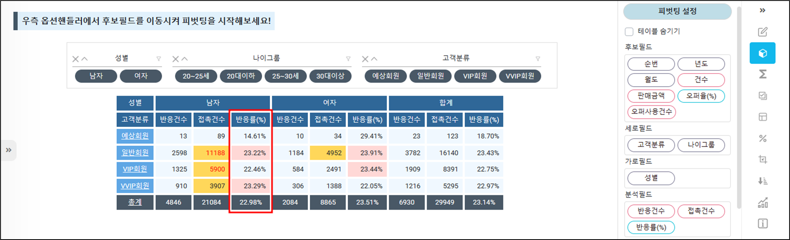

<p align="center"><font size="2m">반응건수 / 접촉건수 * 100 의 계산식으로 반응률이 계산되었다.</font></p>

<br>
<br>

## 15. Thousand_delimeter & Blank_text & Selectcolor

| 옵션                      | 내용                               | 옵션 설정 값 및 예시                                |
| ------------------------- | ---------------------------------- | --------------------------------------------------- |
| "thousand_delimeter": "," | 천단위 구분자                      | ","  /  "."                                         |
| "blank_text": "(blank)"   | 데이터가 없는 경우 출력되는 텍스트 | "(blank)"                                           |
| "selectcolor": "#FFF94D"  | 피벗테이블의 셀 선택시 색상선택    | 다양한 색깔을 피벗테이블과 어울리도록 사용자화 가능 |

```json
{
	"Layout": {
		"thousand_delimeter": ",",
		"blank_text": "(blank)",
		"selectcolor": "#999999",
```

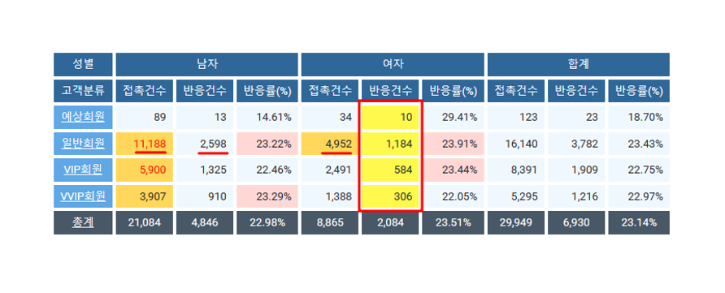

<br>
<br>

## 16. Column & Sub & Grand total

합계옵션을 설정할 수 있습니다. 우측 기능탭 ( 옵션핸들러 )에서도 해당기능을 체크박스로 사용할 수 있습니다.<br>

| 옵션                                      | 내용                                 | 옵션 설정 값 및 예시                                         |
| ----------------------------------------- | ------------------------------------ | ------------------------------------------------------------ |
| "columntotal" , "subtotal" , "grandtotal" | 합계 옵션                            |                                                              |
| "show": true                              | 합계옵션을 보여 줄 것인지 설정합니다 | true / false                                                 |
| "label": "합계"                           | 합계옵션의 레이블                    | 사용자가 지정한 이름 ex) 소계, 합계, 총계, 총액, 부분합, 총합등 |

```json
{
	"Layout": {
		"columntotal": {
			"show": true,
			"label": "합계"
		},
		"subtotal": {
			"show": false,
			"label": "소계"
		},
		"grandtotal": {
			"show": true,
			"label": "총계"
		},
```

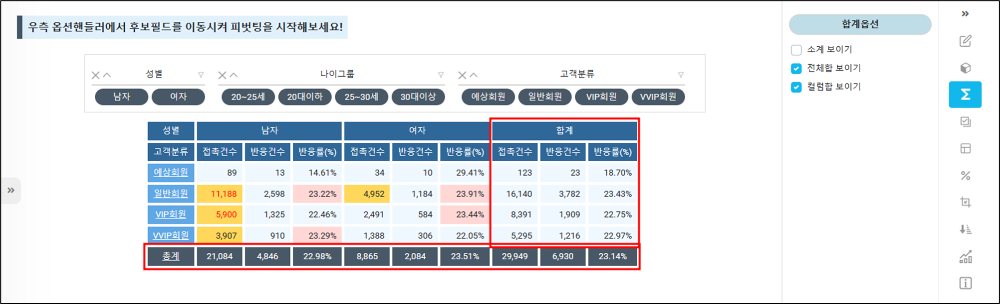

<br>
<br>

## 17. Percentage

피벗테이블의 수치형 필드에 대하여 퍼센트(%) 값을 적용하여 보여 주는 옵션입니다.<br>
우측 기능탭 ( 옵션핸들러 )에서도 해당기능을 사용할 수 있습니다.<br>

| 옵션                     | 내용                                                       | 옵션 설정 값 및 예시                                         |
| ------------------------ | ---------------------------------------------------------- | ------------------------------------------------------------ |
| "field": "ResponseCount" | 대상필드명                                                 | "대상필드명"                                                 |
| "option": "BYGRANDTOTAL" | 전체합대비 , 열합대비 , 컬럼합대비 , 부분합대비 퍼센트지정 | "BYGRANDTOTAL" , "BYROWTOTAL" , "BYCOLUMNTOTAL", "BYROWSUBTOTAL" |
| "precision": ".00"       | 소수점자리                                                 | ".0" / ".00"                                                 |
| "surfix": "(%)"          | 미주텍스트                                                 |                                                              |

```json
{
	"Layout": {
		"percentage": [
			{
				"field": "ResponseCount",
				"option": "BYGRANDTOTAL",
				"precision": ".00",
				"surfix": "(%)"
			}
		],
```

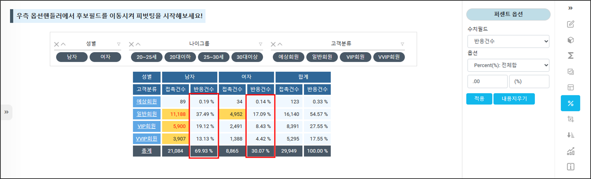

<p align="center"><font size="2m">"ResponseCount" 반응건수를 전체합의 대비 퍼센트로 바꿨다.</font></p>

<br>
<br>

## 18. Formatting

BI-REQUIRED! 에서도 조건부 서식을 사용할 수 있습니다.<br>피벗테이블의 수치형 필드에 대한 포맷팅 옵션입니다.<br>

| 옵션                    | 내용                        | 옵션 설정 값 및 예시                                         |
| ----------------------- | --------------------------- | ------------------------------------------------------------ |
| "field": "ContactCount" | 조건부 서식을 설정할 필드명 | "대상필드명" ( "FieldName" )                                 |
| "type": "bar"           | 조건부 서식의 종류          | "bar" / "map" / "icons"                                      |
| "option": "#ff555a"     | 표현색상 및 아이콘종류      | "#66CBFF" / "5-arrows" , "3-stars" , "4-circles" , "4-bluecircles" , "5-blue_arrows" |

```json
{
	"Layout": {
		"formatting": [
			{
				"field": "ContactCount",
				"type": "map",
				"option": "#66CBFF"
			},
			{
				"field": "ResponseCount",
				"type": "bar",
				"option": "#FFD859"
			},
			{
				"field": "ResponseRate",
				"type": "icons",
				"option": "5-arrows"
			}
		],
```

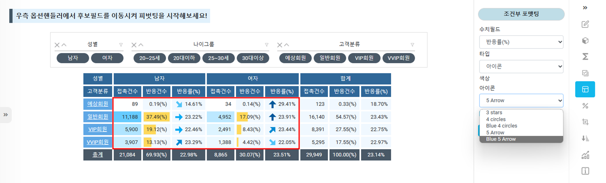

<p align="center"><font size="2m">기능탭 ( 옵션핸들러 ) 에서도 조건부 포맷팅을 사용할 수 있습니다.</font></p>

<br>
<br>

## 19. Themes & Set_theme

피벗테이블의 테마목록과, 기본테마를 설정할 수 있는 옵션입니다.<br>
```json
{
	"Layout": {
		"themes": [
			{
				"name": "ghostwhite",
				"class": "ghostwhite-theme"
			},
			{
				"name": "lightblue",
				"class": "lightblue-theme"
			},
			{
				"name": "lightgrey",
				"class": "lightgrey-theme"
			},
			{
				"name": "aliceblue",
				"class": "aliceblue-theme"
			}
		],
		"set_theme": "aliceblue",
```

