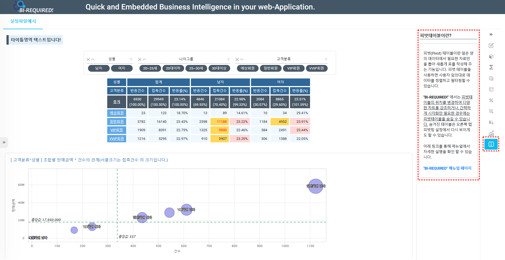

# 설정파일 옵션

BI-REQUIRED! 를 사용하기 위해서는 JSON 으로 구성된 설정파일 ( Layout )을 설정해야 합니다.<br>
이 레이아웃 설정에 따라서 BI-REQUIRED 를 좀 더 사용자 친화적으로 만들어서 상황과 목적에 맞게 적절하게 사용할 수 있습니다.

설정파일의 옵션을 확인해보고, 적용하여 다양한 기능을 알아보겠습니다.

<br>
<br><br>

---

## 옵션

### 1. Info

우측 옵션 핸들러에서 맨 하단 정보( i ) 탭에서 보일 내용을 작성하는 곳 입니다.
사용자에게 정보를 HTML태그를 이용하여 전달할 수 있습니다. 또한 false 값을 만들어 인포탭을 잠금할 수도 있습니다.<br>

``` json
{
    "Layout": {
		"info": "<p style=\"border-bottom: 1px solid #435766; padding: 0.1em; font-	size:15.5px;\"><b>피벗테이블이란?</b></p><p style=\"border: 1px solid #C9C9C9; padding: 0.3em 1em;border-radius: 2px; font-size:13.5px;\"><br>피벗(Pivot) 테이블이란 많은 양의 데이터에서 필요한 자료만을 뽑아 새롭게 표를 작성해 주는 기능입니다. 피벗 테이블을 사용하면 사용자 임의대로 데이터를 정렬하고 필터링할 수 있습니다.<br><br><b>\"BI-REQUIRED!\"</b> 에서는 <ins>피벗테이블의 위치를 변경하여 다양한 차트를 강조하거나, 간략하게 시각화만 필요한 경우에는 피벗테이블을 숨길 수 있습니다.</ins> 숨겨진 테이블은 오른쪽 탭 피벗팅 설정에서 다시 보이게도 할 수 있습니다.<br><br>아래 링크를 통해 매뉴얼에서 자세한 설명을 확인 할 수 있습니다.<br><br><a href = https://easycoresolutions.github.io/BIREQUIRED/ target=_blank rel=noopener noreferrer><b>\"BI-REQUIRED\" 매뉴얼 페이지</b></a><br><br></p>",
```



```json
{
	"Layout": {
		"info": "정보영역-텍스트",
		"title": "타이틀영역-텍스트",
		"grand_total_percent": true,
		"menu_nav": "expended",
		"charts": {
			"charts_config": "pie-sankey.json",
			"show": true,
			"template_list": "0_layout_list.json"
		},
		"table_display": true,
		"expanded_collapsed_mode": true,
		"transpose": false,
		"total_first": true,
		"error_value": "오류",
		"excelfile": "excel_pivot_table_data",
		"rows": [
			"CustType",
			"AgeGroup"
		],
		"columns": [
			"Gender"
		],
		"values": [
			{
				"field": "SalesCount",
				"op": "sum",
				"precision": ""
			},
			{
				"field": "SalesAmt",
				"op": "sum",
				"precision": ""
			}
		],
		"calculated": [
			{
				"fieldheader": "Response(%)",
				"calculatedname": "responseRate",
				"formula": "ResponseCount / ContactCount * 100",
				"precision": ".00",
				"surfix": "%",
				"error_value": "calcu error code"
			},
			{
				"fieldheader": "Offer(%)",
				"calculatedname": "OfferRate",
				"formula": "OfferCount / ContactCount * 100",
				"precision": ".00",
				"surfix": "%",
				"error_value": "calcu error code"
			}
		],
		"thousand_delimeter": "",
		"blank_text": "(blank)",
		"selectcolor": "#999999",
		"columntotal": {
			"show": true,
			"label": "합계"
		},
		"subtotal": {
			"show": false,
			"label": "소계"
		},
		"grandtotal": {
			"show": true,
			"label": "총계"
		},
		"Slicer_display": "expanded",
		"percentage": [
			{
				"field": "SalesCount",
				"option": "BYGRANDTOTAL",
				"precision": ".00",
				"surfix": "(%)"
			}
		],
		"formatting": [
			{
				"field": "SalesCount",
				"type": "bar",
				"option": "#ff555a"
			},
			{
				"field": "SalesAmt",
				"type": "map",
				"option": "#ffff00"
			},
			{
				"field": "ContactCount",
				"type": "icons",
				"option": "5-arrows"
			}
		],
		"themes": [
			{
				"name": "ghostwhite",
				"class": "ghostwhite-theme"
			},
			{
				"name": "lightblue",
				"class": "lightblue-theme"
			},
			{
				"name": "lightgrey",
				"class": "lightgrey-theme"
			}
		],
		"set_theme": "lightblue",
		"slicer": {
			"position": "top",
			"fields": [
				{
					"field": "Gender",
					"size": 5
				}
			]
		},
		"column_sorting": [
			{
				"fieldname": "AGE",
				"sorttype": "DESC"
			}
		],
		"backGroundhighlight": [
			{
				"field": "responseRate",
				"color": "#28a745",
				"condition": [
					"between 22 and 25"
				]
			}
		],
		"foreGroundhighlight": [
			{
				"field": "ContactCount",
				"color": "#ff0000",
				"condition": [
					">1000"
				]
			}
		]
	}
}
```


